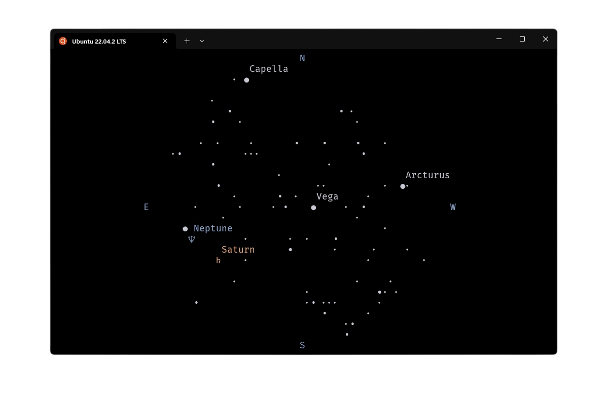

# 🌌 astroterm


`astroterm` is a terminal-based celestial viewer written in `C` using `ncurses`. It renders the live positions of stars, planets, constellations, and more directly in your terminal—no telescope required!. Configure sky views by date, time, and location with precise ASCII-rendered visuals. See [usage](#usage) for all supported options!

`astroterm` is constantly improving, and we'd love to hear your ideas! If you have a suggestion or find a bug, please open an issue and share your feedback.

<p align="center">
  
  
</p>

_<p align="center">Stars above Boston around 9 PM on December 18, 2024</p>_

### Features

- 🔭 **Customizable Sky View:** Choose any date, time, and location to explore past, present, or future celestial events
- 📐 **Accurate Rendering:** Displays moon, stars, and planets as much precision as terminal graphics allow.
- 🌘 **Moon Phases:** Displays precise lunar phases in real-time
- 🌌 **Constellation Figures:** Renders detailed constellation shapes
- ⚡ **Performance Optimized:** Lightweight and fast ASCII rendering

## Installation

### Building from Source

> `ncurses` and `argtable` detection is spotty on some systems, and you may need to install
> [pkg-config](https://www.freedesktop.org/wiki/Software/pkg-config/) in order
> for Meson to find them.

#### Requirements

- Unix-like environment (Linux, macOS, WSL, etc.)
- C compiler
- [`ncurses`](https://invisible-island.net/ncurses/announce.html) library
- [`meson`](https://github.com/mesonbuild/meson) 1.4.0 or newer
- [`ninja`](https://github.com/ninja-build/ninja) 1.8.2 or newer
- [`argtable`](https://argtable.sourceforge.io/)
- Some common CLI tools (_these are checked for automatically during install_)
  - [`wget`](https://www.gnu.org/software/wget/) or [`curl`](https://curl.se/)
  - [`xxd`](https://linux.die.net/man/1/xxd)
  - [`sed`](https://www.gnu.org/software/sed/manual/sed.html)

#### Install

Clone the repository and enter the project directory:

```sh
git clone https://github.com/da-luce/astroterm && cd astroterm
```

Run the install script:

```sh
sh install.sh
```

You may now run the generated `./build/astroterm` binary or add the `astroterm` command system wide via `meson install -C build`. Pressing <kbd>q</kbd> or <kbd>ESC</kbd> will exit the display.

## Usage

### Options

The `--help` flag displays all supported options:

```text
Usage: astroterm [OPTION]...

  -a, --latitude=<degrees>  Observer latitude [-90°, 90°] (default: 42.361145)
  -o, --longitude=<degrees> Observer longitude [-180°, 180°] (default:
                            -71.057083)
  -d, --datetime=<yyyy-mm-ddThh:mm:ss>
                            Observation datetime in UTC
  -t, --threshold=<float>   Only render stars brighter than this magnitude
                            (default: 3.0)
  -l, --label-thresh=<float>
                            Label stars brighter than this magnitude (default:
                            0.5)
  -f, --fps=<int>           Frames per second (default: 24)
  -s, --speed=<float>       Animation speed multiplier (default: 1.0)
  -c, --color               Enable terminal colors
  -C, --constellations      Draw constellations stick figures. Note: a
                            constellation is only drawn if all stars in the
                            figure are over the threshold
  -g, --grid                Draw an azimuthal grid
  -A, --ascii               Only use ASCII characters
  -m, --meta                Display metadata
  -h, --help                Print this help message
```

### Example

Say we wanted to view the sky at 5:00 AM (Eastern) on July 16, 1969—the morning
of the Apollo 11 launch at the Kennedy Space Center in Florida. We would run:

```sh
astroterm --latitude 28.573469 --longitude -80.651070 --datetime 1969-7-16T9:00:00
```

Since timetravel hasn't been invented yet, we can use [Stellarium](https://stellarium-web.org/skysource/UpsPeg?fov=185.00&date=1969-07-19T09:00:00Z&lat=28.47&lng=-80.56&elev=0) to confirm that this aligns with realty.

If we then wanted to display all stars with a magnitude brighter than or equal
to 5.0 and add color, we would add `--threshold 5.0 --color` as options.

If you simply want the current time, don't specify the `--datetime` option and
_astroterm_ will use the system time. For your current location, you will still
have to specify the `--lat` and `--long` options.

For more options and help run `astroterm -h` or `astroterm --help`.

> ℹ️ Use a tool like [LatLong](https://www.latlong.net/) to get your latitude and longitude.

> ℹ️ Star magnitudes decrease as apparent brightness increases, i.e. to show more stars, increase the threshold.

## Development

### Testing

Run `meson test` within the build directory. To get a coverage report, subsequently run `ninja coverage`.

## Citations

Many thanks to the following resources, which were invaluable to the development of this project.

- [Map Projections-A Working Manual By John P. Snyder](https://pubs.usgs.gov/pp/1395/report.pdf)
- [Wikipedia](https://en.wikipedia.org)
- [Atractor](https://www.atractor.pt/index-_en.html)
- [Jon Voisey's Blog: Following Kepler](https://jonvoisey.net/blog/)
- [Celestial Programming: Greg Miller's Astronomy Programming Page](https://astrogreg.com/convert_ra_dec_to_alt_az.html)
- [Practical Astronomy with your Calculator by Peter Duffett-Smith](https://www.amazon.com/Practical-Astronomy-Calculator-Peter-Duffett-Smith/dp/0521356997)
- [NASA Jet Propulsion Laboratory](https://ssd.jpl.nasa.gov/planets/approx_pos.html)
- [Paul Schlyter's "How to compute planetary positions"](https://stjarnhimlen.se/comp/ppcomp.html)
- [Dan Smith's "Meeus Solar Position Calculations"](https://observablehq.com/@danleesmith/meeus-solar-position-calculations)
- [Bryan Weber's "Orbital Mechanics Notes"](https://github.com/bryanwweber/orbital-mechanics-notes)
- [ASCOM](https://ascom-standards.org/Help/Developer/html/72A95B28-BBE2-4C7D-BC03-2D6AB324B6F7.htm)
- [A Fast Bresenham Type Algorithm For Drawing Ellipses](https://dai.fmph.uniba.sk/upload/0/01/Ellipse.pdf)

## Data Sources

- Stars: [Yale Bright Star Catalog](http://tdc-www.harvard.edu/catalogs/bsc5.html)
- Star names: [IAU Star Names](https://www.iau.org/public/themes/naming_stars/)
- Constellation figures: [Stellarium](https://github.com/Stellarium/stellarium/blob/3c8d3c448f82848e9d8c1af307ec4cad20f2a9c0/skycultures/modern/constellationship.fab#L6) (Converted from [Hipparchus](https://heasarc.gsfc.nasa.gov/w3browse/all/hipparcos.html) to [BSC5](http://tdc-www.harvard.edu/catalogs/bsc5.html) indices using the [HYG Database](https://www.astronexus.com/projects/hyg)—see [convert_constellations.py](./scripts/convert_constellations.py))
- Planet orbital elements: [NASA Jet Propulsion Laboratory](https://ssd.jpl.nasa.gov/planets/approx_pos.html)
- Planet magnitudes: [Computing Apparent Planetary Magnitudes for The Astronomical Almanac](https://arxiv.org/abs/1808.01973)
